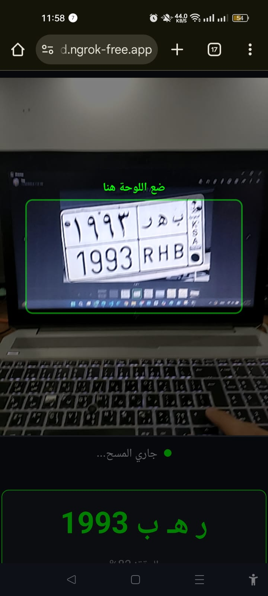
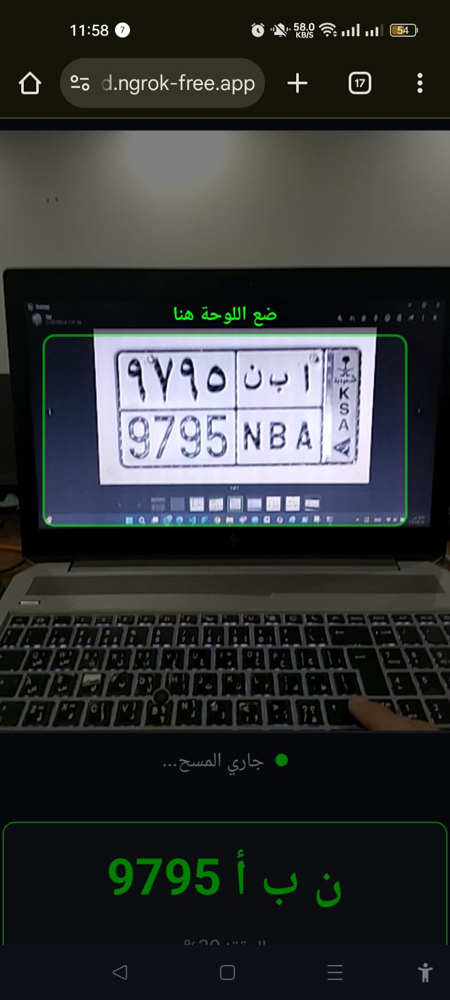

# 🦅 VisionGate: Enterprise Saudi ANPR System

<div align="center">


<br>

**A High-Performance, Hybrid AI System for Real-Time Saudi License Plate Recognition**  
*Engineered for Security Patrols, Smart Airports, and Gated Communities.*

</div>

---

## 📖 Executive Summary

**VisionGate** is a **production-grade ANPR microservice** designed for real-world vehicle security and access control in the **Kingdom of Saudi Arabia**.

Unlike generic OCR projects, VisionGate is engineered to handle **real operational challenges**:

- 🚗 **Motion Blur** — Reads plates from moving vehicles  
- 📐 **Angled Views** — Supports up to **45° skew**  
- 🌙 **Low Light & Glare** — Image enhancement via CLAHE  
- 🌍 **Dual Language** — Arabic & English plates simultaneously  

The system is **mobile-first**, allowing security officers to scan vehicles directly from their phones while all AI processing runs securely on the backend.

---

## 📱 Live Mobile Deployment (Real Screenshots)

The following screenshots are **real captures from a live mobile patrol deployment**.

| Live Detection | Recognition & Logging |
|:--------------:|:---------------------:|
|  |  |
| Real-time bounding boxes | < 100ms inference & hotlist check |

> 🟢 Green / 🔴 Red visual feedback is provided instantly based on vehicle status.

---

## 🏗️ System Architecture

VisionGate follows a **scalable microservices architecture**, capable of processing:

- Mobile HTTPS uploads  
- CCTV RTSP video streams  

```

🌍 Real-World Use Cases
1. Smart Parking (Ticketless Entry)
Automating entry for thousands of cars daily with high throughput.

sequenceDiagram
    participant Car as 🚗 Vehicle
    participant Cam as 📹 Camera
    participant API as 🦅 VisionGate API
    participant Gate as 🚧 Barrier

    Car->>Cam: Approaches Gate
    Cam->>API: Sends Frame
    Note over API: Enhancing -> YOLO -> OCR
    API->>API: Validate Saudi Syntax
    API-->>Gate: {status: "Authorized", plate: "1234 KSA"}
    Gate->>Car: Opens Barrier (0.2s Latency)

2. Law Enforcement (Patrol Units)
Helping officers identify stolen vehicles in real-time
sequenceDiagram
    participant Officer as 👮 Mobile App
    participant API as 🦅 VisionGate API
    participant DB as 💾 Hotlist DB

    Officer->>API: Captures Plate Image
    API->>DB: Check "Wanted" Status
    
    alt Vehicle is Wanted
        DB-->>API: ALERT: Stolen Vehicle!
        API-->>Officer: 🚨 RED ALERT SCREEN
    else Vehicle Clear
        API-->>Officer: ✅ Status Clear
    end

2. Law Enforcement (Patrol Units)
Helping officers identify stolen vehicles in real-time.
sequenceDiagram
    participant Officer as 👮 Mobile App
    participant API as 🦅 VisionGate API
    participant DB as 💾 Hotlist DB

    Officer->>API: Captures Plate Image
    API->>DB: Check "Wanted" Status
    
    alt Vehicle is Wanted
        DB-->>API: ALERT: Stolen Vehicle!
        API-->>Officer: 🚨 RED ALERT SCREEN
    else Vehicle Clear
        API-->>Officer: ✅ Status Clear
    end
🛠️ Technical Highlights
🔹 The Hybrid AI Pipeline
Standard models fail on angled plates common in CCTV setups. VisionGate uses a custom pipeline:

Localization: YOLOv8n trained specifically on Saudi datasets (King Saud University Benchmark).

Refinement: Custom unclip_ratio=1.8 parameter in PaddleOCR to expand bounding boxes for slanted text.

Failover: Automatically degrades from GPU (CUDA) to CPU if hardware issues are detected, ensuring 24/7 uptime.

🔹 The Logic Mapper (Mapper.py)
Raw OCR output is often noisy. The SaudiPlateMapper class implements heuristic logic:

Symbol Filtering: Removes non-alphanumeric noise.

Spatial Logic: Prioritizes the right-most 3 letters (Arabic standard).

Syntax Enforcement: Validates [3 Letters] + [3-4 Numbers] structure.

💻 Installation & Setup

Prerequisites: Python 3.9+, CUDA Toolkit (Optional).

# 1. Clone the Repository
git clone [https://github.com/hussien-elgamal/Saudi-ANPR-System.git](https://github.com/hussien-elgamal/Saudi-ANPR-System.git)
cd Saudi-ANPR-System

# 2. Install Dependencies
pip install -r requirements.txt

# 3. Run the Microservice
uvicorn api.main:app --reload --host 0.0.0.0 --port 8000

API Response Example
POST /detect/

{
  "status": "success",
  "data": {
    "plate_ar": "ق ب ب 6102",
    "plate_en": "6102 G B B",
    "confidence": 0.98,
    "is_wanted": false,
    "action": "LOG_AND_PASS"
  }
}
👨‍💻 Author
Hussien Elgamal Mid-Level AI Engineer & Data Specialist

Open for collaboration on Computer Vision, Smart City, and Security AI projects.
